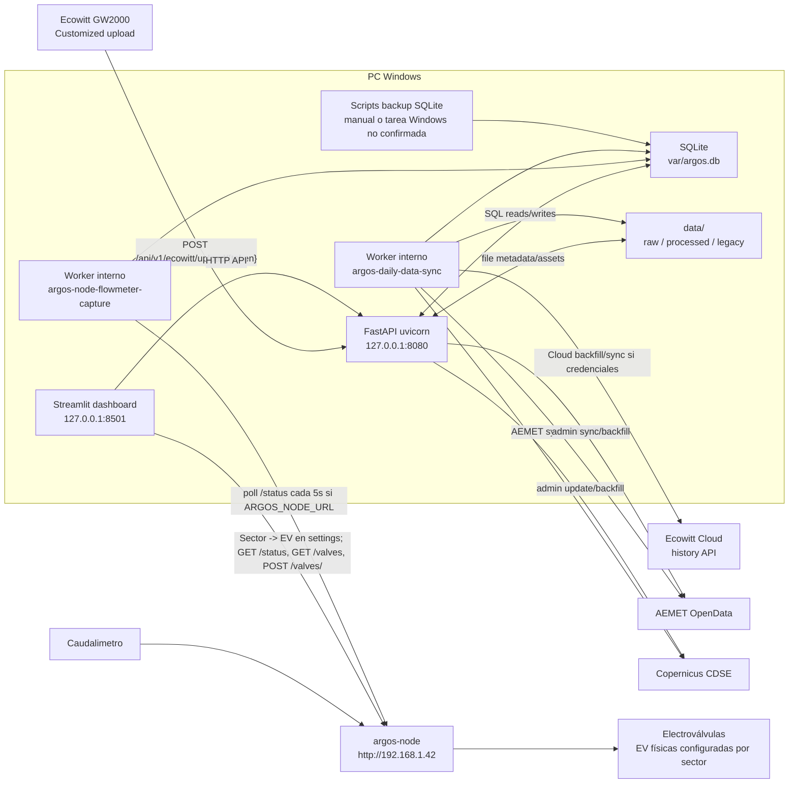

# Topologia runtime de ARGOS

Estado: Vigente
Tipo: Diagrama operativo
Fuente de verdad: codigo y procesos observados
Ultima actualizacion: 2026-08-15
Responsable logico: Mantenimiento de software
Revision: 2

Solo se dibujan componentes confirmados por codigo, configuracion o ejecucion observada.

## Notas

- La operacion de electroválvulas del dashboard habla directamente con `argos-node`; no pasa por FastAPI.
- La tarea Windows de backup no se dibuja como activa porque su registro no esta confirmado.
- La alimentacion fisica del controlador y la conexion electrica de las electroválvulas son Pendiente de validacion operativa.
